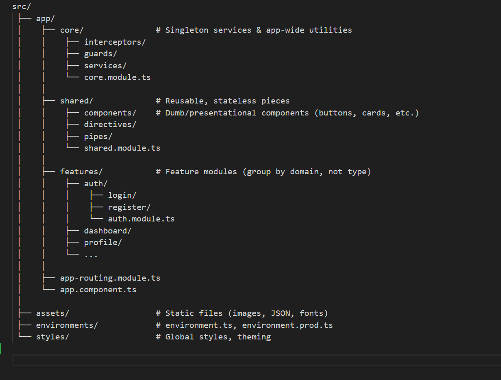

src/
 ├── app/
 │    ├── core/               # Singleton services & app-wide utilities
 │    │    ├── interceptors/
 │    │    ├── guards/
 │    │    ├── services/
 │    │    └── core.module.ts
 │    │
 │    ├── shared/             # Reusable, stateless pieces
 │    │    ├── components/    # Dumb/presentational components (buttons, cards, etc.)
 │    │    ├── directives/
 │    │    ├── pipes/
 │    │    └── shared.module.ts
 │    │
 │    ├── features/           # Feature modules (group by domain, not type)
 │    │    ├── auth/
 │    │    │    ├── login/
 │    │    │    ├── register/
 │    │    │    └── auth.module.ts
 │    │    ├── dashboard/
 │    │    ├── profile/
 │    │    └── ...
 │    │
 │    ├── app-routing.module.ts
 │    └── app.component.ts
 │
 ├── assets/                  # Static files (images, JSON, fonts)
 ├── environments/            # environment.ts, environment.prod.ts
 └── styles/                  # Global styles, theming

